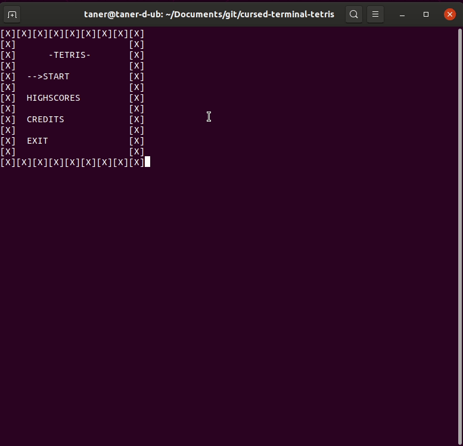

# cursed-terminal-tetris

A Tetris clone playable on terminal very quickly.

`build size: 28KB`
`debug size: 80KB`
`repo size: 1.5MB`

#### Building on debian based OS:

`g++`  : <https://gcc.gnu.org/>

`ncurses` : <https://invisible-island.net/ncurses>

`make` : https://www.gnu.org/software/make/

     git clone https://github.com/taner1es/cursed-terminal-tetris.git
     sudo apt install g++
     sudo apt install libncurses-dev
     sudo apt install make
     cd cursed-terminal-tetris
     make
     build/tetris.build
